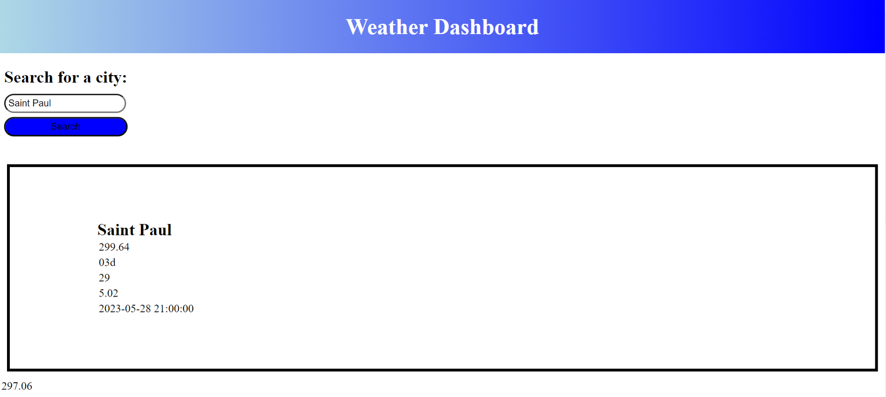

# weatherapi
An application to display information about the weather forecast in different cities.

## Description

The purpose of this application is to get the weather conditions of a city from a source and display the conditions within a 5-day projection.

## Usage

Upon opening the application, as the user, you'll be able to search for a city and find out the temperature, weather condition, humidity, wind speeds, and the date of those conditions.

## Credit

N/A

## License

N/A